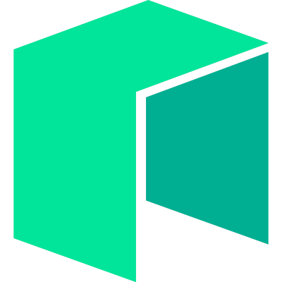

# Neo N3 MCP Server

<p align="center">
  
</p>

An MCP server that provides seamless integration with the Neo N3 blockchain, allowing Claude to interact with blockchain data, manage wallets, transfer assets, and invoke smart contracts.

[](LICENSE)
[](https://nodejs.org)
[](https://www.docker.com/)
[](https://www.npmjs.com/package/@r3e/neo-n3-mcp)
[](https://github.com/R3E-Network/neo-n3-mcp/actions)
[](https://github.com/R3E-Network/neo-n3-mcp/actions)
[](https://github.com/R3E-Network/neo-n3-mcp/releases)

## 📚 Documentation

- [Website](https://neo-n3-mcp.netlify.app) - Comprehensive website with documentation, user guides and examples
- [API Reference](API.md) - Detailed API documentation for all tools and resources
- [Deployment Guide](DEPLOYMENT.md) - Comprehensive deployment options and configuration
- [Testing Guide](TESTING.md) - Testing approach and instructions for verifying functionality
- [Architecture](ARCHITECTURE.md) - Detailed system architecture and design decisions
- [Network Architecture](NETWORKS.md) - Dual-network support and configuration details

## 🚀 Features

- **Dual Network Support**: Interact with both Neo N3 mainnet and testnet networks in a single server
- **Blockchain Information**: Query blockchain height, validators, and network status
- **Block & Transaction Data**: Get detailed information about blocks and transactions
- **Account Management**: Check balances, create and import wallets securely
- **Asset Operations**: Transfer NEO, GAS, and other tokens between addresses
- **Smart Contract Interaction**: Deploy and invoke smart contracts on the Neo N3 blockchain
- **Famous Contracts Support**: Interact with NeoFS, NeoBurger, Flamingo, NeoCompound, GrandShare, and GhostMarket
- **Transaction Monitoring**: Check detailed transaction status with confirmation tracking
- **Gas Fee Estimation**: Calculate estimated gas fees for transfers before executing them
- **Resilient RPC Communication**: Automatic retry mechanisms with exponential backoff
- **Security Focused**: Input validation, secure wallet storage, and protection of private keys
- **Docker Support**: Easy deployment with Docker and Docker Compose
- **One-Click Installation**: Simple setup process for Claude integration

## 🔄 What's New in v1.0.8

- **Enhanced RPC Reliability**: Using secure HTTPS endpoints for both networks:
  - Mainnet: `https://mainnet1.neo.coz.io:443`
  - Testnet: `https://testnet1.neo.coz.io:443`
- **Comprehensive Website**: New website with detailed documentation, user guides, and integration examples
- **Improved Development Tools**: Added rebuild scripts and dark mode support
- **Better Documentation**: Enhanced documentation organization and readability

## Configuration with MCP

You can easily add the Neo N3 MCP server to your Claude MCP configuration in different ways:

### Using NPM (Recommended for Quick Start)

Add this to your `claude_desktop_config.json` or MCP settings:

```json
{
  "mcpServers": {
    "neo-n3": {
      "command": "npx",
      "args": [
        "-y",
        "@r3e/neo-n3-mcp"
      ]
    }
  }
}
```

This will automatically download and run the Neo N3 MCP server without any local installation.

### Using Docker

Add this to your `claude_desktop_config.json` or MCP settings:

```json
{
  "mcpServers": {
    "neo-n3": {
      "command": "docker",
      "args": [
        "run",
        "--rm",
        "-i",
        "r3e/neo-n3-mcp"
      ]
    }
  }
}
```

To build the Docker image locally:

```bash
docker build -t r3e/neo-n3-mcp .
```

## Installation

### Using Docker (recommended)

```bash
# Clone the repository
git clone https://github.com/R3E-Network/neo-n3-mcp.git
cd neo-n3-mcp

# Start the server with Docker Compose
docker-compose up -d
```

### Manual Installation

```bash
# Clone the repository
git clone https://github.com/R3E-Network/neo-n3-mcp.git
cd neo-n3-mcp

# Install dependencies
npm install

# Build the project
npm run build

# Start the server
npm start
```

### Adding to MCP Settings

To add the Neo N3 MCP server to your MCP settings, you can use the provided script:

```bash
# Build the project first
npm run build

# Add to MCP settings
npm run add-to-mcp
```

This will automatically add the Neo N3 MCP server to your Claude MCP settings file, making it available for use with Claude.

## Configuration

The server can be configured using environment variables:

- `NEO_RPC_URL`: Default URL of the Neo N3 RPC node (default: https://mainnet1.neo.coz.io:443)
- `NEO_MAINNET_RPC_URL`: URL of the Neo N3 mainnet RPC node (default: same as NEO_RPC_URL or https://mainnet1.neo.coz.io:443)
- `NEO_TESTNET_RPC_URL`: URL of the Neo N3 testnet RPC node (default: https://testnet1.neo.coz.io:443)
- `NEO_NETWORK`: Default network type: 'mainnet' or 'testnet' (default: mainnet)
- `WALLET_PATH`: Path to the wallet files (default: ./wallets)
- `LOG_LEVEL`: Log level: 'debug', 'info', 'warn', 'error' (default: info)
- `LOG_CONSOLE`: Whether to log to console (default: true)
- `LOG_FILE`: Whether to log to file (default: false)
- `LOG_FILE_PATH`: Path to log file (default: ./logs/neo-n3-mcp.log)
- `MAX_REQUESTS_PER_MINUTE`: Maximum number of requests per minute (default: 60)
- `REQUIRE_CONFIRMATION`: Whether to require confirmation for sensitive operations (default: true)

## Usage

### Tools

All tools now support an optional `network` parameter to specify which network to use ('mainnet' or 'testnet').

#### get_blockchain_info

Get general information about the Neo N3 blockchain.

```json
{
  "name": "get_blockchain_info",
  "arguments": {
    "network": "testnet"
  }
}
```

#### get_block

Get block details by height or hash.

```json
{
  "name": "get_block",
  "arguments": {
    "hashOrHeight": 12345,
    "network": "mainnet"
  }
}
```

#### get_transaction

Get transaction details by hash.

```json
{
  "name": "get_transaction",
  "arguments": {
    "txid": "0xabcdef1234567890abcdef1234567890abcdef1234567890abcdef1234567890",
    "network": "testnet"
  }
}
```

#### get_balance

Get account balance for a specific address.

```json
{
  "name": "get_balance",
  "arguments": {
    "address": "NXV7ZhHiyM1aHXwvUNBLNAkCwZ6wgeKyMZ",
    "network": "mainnet"
  }
}
```

#### transfer_assets

Transfer assets between addresses.

```json
{
  "name": "transfer_assets",
  "arguments": {
    "fromWIF": "KwDZGCUXYAB1cUNmZKQ5RFUBAYPjwXvpavQQHvpeH1qM5pJ3zurn",
    "toAddress": "NXV7ZhHiyM1aHXwvUNBLNAkCwZ6wgeKyMZ",
    "asset": "NEO",
    "amount": "1",
    "confirm": true,
    "network": "testnet"
  }
}
```

#### invoke_contract

Invoke a smart contract method.

```json
{
  "name": "invoke_contract",
  "arguments": {
    "fromWIF": "KwDZGCUXYAB1cUNmZKQ5RFUBAYPjwXvpavQQHvpeH1qM5pJ3zurn",
    "scriptHash": "0x8c23f196d8a1bfd103a9dcb1f9ccf0c611377d3b",
    "operation": "transfer",
    "args": [
      {
        "type": "Hash160",
        "value": "NXV7ZhHiyM1aHXwvUNBLNAkCwZ6wgeKyMZ"
      },
      {
        "type": "Hash160",
        "value": "NXV7ZhHiyM1aHXwvUNBLNAkCwZ6wgeKyMZ"
      },
      {
        "type": "Integer",
        "value": "1"
      },
      {
        "type": "Any",
        "value": null
      }
    ],
    "confirm": true,
    "network": "testnet"
  }
}
```

#### create_wallet

Create a new wallet.

```json
{
  "name": "create_wallet",
  "arguments": {
    "password": "your-secure-password",
    "network": "mainnet"
  }
}
```

#### import_wallet

Import an existing wallet from WIF or encrypted key.

```json
{
  "name": "import_wallet",
  "arguments": {
    "key": "KwDZGCUXYAB1cUNmZKQ5RFUBAYPjwXvpavQQHvpeH1qM5pJ3zurn",
    "password": "your-secure-password",
    "network": "testnet"
  }
}
```

### Resources

#### Neo N3 Network Status

Default network (based on configuration):
```
neo://network/status
```

Specific networks:
```
neo://mainnet/status
neo://testnet/status
```

#### Neo N3 Block by Height

Default network:
```
neo://block/{height}
```

Specific networks:
```
neo://mainnet/block/{height}
neo://testnet/block/{height}
```

#### Neo N3 Address Balance

Default network:
```
neo://address/{address}/balance
```

Specific networks:
```
neo://mainnet/address/{address}/balance
neo://testnet/address/{address}/balance
```

## Testing

The Neo N3 MCP server includes comprehensive tests to ensure its functionality. There are two primary ways to run tests:

### Using Jest (TypeScript Tests)

Jest tests provide comprehensive testing with proper mocking:

```bash
# Install dependencies first
npm install

# Run Jest tests
npm test
```

The test suite includes tests for:
- Blockchain information retrieval
- Block and transaction data access
- Account balance queries
- Wallet creation and import
- Asset transfers
- Smart contract invocation

### Using Simple Test Runner (JavaScript)

A simplified JavaScript test runner is also available for quick testing:

```bash
# Run the simplified test
node tests/simple-test.js
```

This test covers the core API functionality without requiring TypeScript compilation.

## Development and Contributing

### Publishing

To publish the package to NPM and/or Docker registries:

```bash
# Publish to NPM
npm run publish:npm

# Build and publish Docker image
npm run publish:docker

# Publish to both
npm run publish:all
```

### Development Setup

For development, use:

```bash
# Build with TypeScript watching
npm run dev
```

## Security Considerations

- Private keys are never exposed in responses
- Sensitive operations (transfers, contract invocations) require explicit confirmation
- Input validation is performed for all parameters
- Error messages are designed to be informative without exposing sensitive information

## Technical Details

### Service Architecture

The Neo N3 MCP server is structured around several key components:

1. **MCP Interface**: Implemented in `src/index.ts` - Handles MCP protocol communication
2. **Neo Service**: Implemented in `src/services/neo-service.ts` - Core Neo N3 blockchain interactions
3. **Validation**: Implemented in `src/utils/validation.ts` - Parameter validation
4. **Error Handling**: Implemented in `src/utils/error-handler.ts` - Standardized error responses

### Error Handling

Errors are standardized through the `handleError` function which:
- Converts Neo N3 specific errors to user-friendly messages
- Masks sensitive information
- Provides clear actionable information to users

### Networking

The server automatically handles network retries and errors when connecting to the Neo N3 blockchain network. Connection parameters like timeouts and retry attempts can be configured through environment variables.

## Project Structure

The project is organized as follows:

```
neo-n3-mcp/
├── src/
│   ├── services/
│   │   └── neo-service.ts       # Core Neo N3 blockchain interaction
│   ├── utils/
│   │   ├── validation.ts        # Input validation
│   │   └── error-handler.ts     # Error handling and responses
│   ├── config.ts                # Configuration settings
│   └── index.ts                 # MCP server and tool definitions
├── tests/
│   ├── neo-service.test.ts      # Jest tests for NeoService
│   └── simple-test.js           # Simple JavaScript test runner
├── scripts/
│   ├── add-to-mcp-settings.js   # Script to add to MCP settings
│   ├── publish-npm.js           # Script to publish to NPM
│   └── publish-docker.sh        # Script to build and publish Docker image
├── wallets/                     # Wallet storage directory
├── dist/                        # Compiled TypeScript output
├── docker-compose.yml           # Docker Compose configuration
├── Dockerfile                   # Docker container definition
├── package.json                 # Node.js package definition
└── tsconfig.json                # TypeScript configuration
```

## Acknowledgments

This project would not be possible without the following:

- [**@cityofzion/neon-js**](https://github.com/CityOfZion/neon-js) - The official JavaScript SDK for Neo N3 blockchain, providing the core functionality for interacting with the Neo N3 network. Special thanks to the City of Zion team for their ongoing development and maintenance of this essential library.
- [**MCP Protocol**](https://github.com/modelcontextprotocol) - For providing the standardized protocol for AI systems to interact with external tools and resources.

## License

This MCP server is licensed under the MIT License. See the [LICENSE](LICENSE) file for details.

## Famous Neo N3 Contracts Support

The Neo N3 MCP Server now includes support for interacting with famous Neo N3 contracts like:

- **NeoFS**: Decentralized storage system on Neo N3 blockchain
- **NeoBurger**: Neo N3 staking service
- **Flamingo (FLM)**: Neo N3 DeFi platform
- **NeoCompound**: Automatic yield farming protocol on Neo N3
- **GrandShare**: Profit sharing protocol on Neo N3
- **GhostMarket**: NFT marketplace on Neo N3

### Contract Tools

#### Listing and Information

- `list_famous_contracts`: List all supported famous Neo N3 contracts
- `get_contract_info`: Get details about a specific famous contract

#### NeoFS Tools

- `neofs_create_container`: Create a storage container in NeoFS
- `neofs_get_containers`: Get containers owned by an address

#### NeoBurger Tools

- `neoburger_deposit`: Deposit NEO to NeoBurger to receive bNEO tokens
- `neoburger_withdraw`: Withdraw NEO from NeoBurger by returning bNEO tokens
- `neoburger_get_balance`: Get bNEO balance of an account
- `neoburger_claim_gas`: Claim accumulated GAS rewards from NeoBurger

#### Flamingo Tools

- `flamingo_stake`: Stake FLM tokens on Flamingo
- `flamingo_unstake`: Unstake FLM tokens from Flamingo
- `flamingo_get_balance`: Get FLM token balance

#### NeoCompound Tools

- `neocompound_deposit`: Deposit assets into NeoCompound
- `neocompound_withdraw`: Withdraw assets from NeoCompound
- `neocompound_get_balance`: Get balance of deposited assets in NeoCompound

#### GrandShare Tools

- `grandshare_deposit`: Deposit assets into GrandShare pool
- `grandshare_withdraw`: Withdraw assets from GrandShare pool
- `grandshare_get_pool_details`: Get details about a GrandShare pool

#### GhostMarket Tools

- `ghostmarket_create_nft`: Create a new NFT on GhostMarket
- `ghostmarket_list_nft`: List an NFT for sale on GhostMarket
- `ghostmarket_buy_nft`: Buy a listed NFT on GhostMarket
- `ghostmarket_get_token_info`: Get information about an NFT on GhostMarket

### Examples

#### Getting a List of Famous Contracts

```javascript
const result = await callTool('list_famous_contracts', {
  network: 'mainnet'
});
```

#### Getting Contract Information

```javascript
const result = await callTool('get_contract_info', {
  contractName: 'flamingo',
  network: 'mainnet'
});
```

#### Depositing to NeoBurger

```javascript
const result = await callTool('neoburger_deposit', {
  fromWIF: 'your-private-key-wif-format',
  confirm: true,
  network: 'mainnet'
});
```

#### Staking on Flamingo

```javascript
const result = await callTool('flamingo_stake', {
  fromWIF: 'your-private-key-wif-format',
  amount: '100',
  confirm: true,
  network: 'mainnet'
});
```

#### Depositing to NeoCompound

```javascript
const result = await callTool('neocompound_deposit', {
  walletPath: '/path/to/wallet.json',
  walletPassword: 'your-password',
  assetId: '0xd2a4cff31913016155e38e474a2c06d08be276cf',
  amount: '100',
  network: 'mainnet'
});
```

#### Creating an NFT on GhostMarket

```javascript
const result = await callTool('ghostmarket_create_nft', {
  walletPath: '/path/to/wallet.json',
  walletPassword: 'your-password',
  tokenURI: 'https://example.com/nft/metadata.json',
  properties: [
    { key: "artist", value: "ExampleArtist" },
    { key: "edition", value: "1/1" }
  ],
  network: 'mainnet'
});
```

#### Getting GrandShare Pool Details

```javascript
const result = await callTool('grandshare_get_pool_details', {
  poolId: 1,
  network: 'mainnet'
});
```
